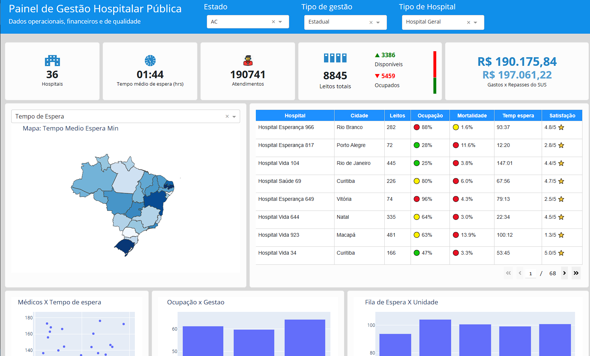

# 🏥 Painel de Gestão Hospitalar Pública

Este projeto é um **dashboard interativo** construído com **Dash + Plotly + Python**, focado na **análise de indicadores operacionais e financeiros de hospitais públicos no Brasil**. Ele apresenta gráficos dinâmicos, mapa interativo, KPIs, indicadores de leitos e gastos, além de uma interface moderna e responsiva com **Dash Bootstrap**.

---



## 🚀 Funcionalidades

- 🏥 Filtros por Estado, Tipo de Gestão e Tipo de Hospital
- 📈 Indicadores de Hospitais, Leitos, Atendimentos e Tempo Médio
- 💰 Gráficos de Gastos x Repasses do SUS
- 📊 Gráfico de Dispersão: Médicos x Tempo de Espera
- 🗺️ Mapa interativo por Estado com múltiplas métricas
- 📋 Tabela dinâmica com emojis e estrelas de satisfação
- 🎯 Visual moderno e adaptado a produção (Heroku/Render)

---

## 🛠️ Tecnologias Utilizadas

- Python
- Dash
- Plotly
- Pandas
- Dash Bootstrap Components
- Dash Bootstrap Templates
- Gunicorn (para deploy)

---

## 📂 Organização do Projeto

```
📁 painel-hospitalar/
├── app.py                        # Código principal do dashboard
├── dataset_saude.csv             # Base de dados hospitalares
├── requirements.txt              # Dependências do projeto
├── Procfile                      # Instrução para deploy no Heroku
├── README.md                     # Este arquivo
└── assets/                       # Ícones SVG usados no layout
    ├── hospital.svg
    ├── att.svg
    ├── leitos.svg
    └── relogio.svg
```

## 📸 Screenshots

| KPIs de Indicadores               | Gráfico de Dispersão                |
|----------------------------------|-------------------------------------|
|  |  |

---

## 👨‍💻 Autor

**Luis Felipe C V Silva**  
🔗 [GitHub](https://github.com/maxforcedev)  
🔗 [LinkedIn](https://linkedin.com/in/maxforcedev)

---

## 📌 Status

✔️ Projeto pronto para deploy  
🚀 Melhorias futuras: exportação de relatórios, modo escuro, painel administrativo, tela de login, filtragem por intervalo de data

---

## 🏁 Licença

MIT - Livre para estudar, usar, modificar e distribuir.